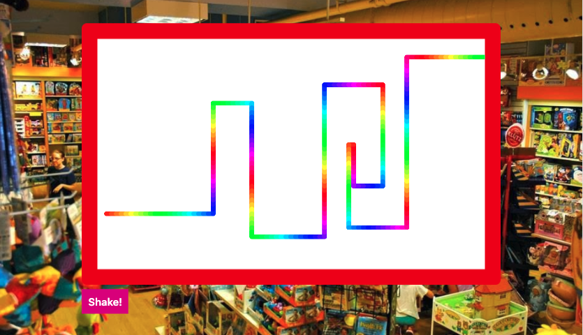

> This is a JavaScript practice from [Slam Dunk JS](https://beginnerjavascript.com/) course by [Wes Bos](https://github.com/wesbos).

# 33 - Etch a Sketch

 

#### LIVE LINK: 

https://nhingo.com/SlamDunkJS/33-etch-a-sketch

## User Stories

- I can start drawing using the arrow keys (Up, Down, Right, Left)
- I can click on the Shake button to start over 

## Notes

https://www.notion.so/nhiyngo/JS-33-Etch-a-Sketch-d34a24c9a0ad4ffaa0fd7e7a882e56d6