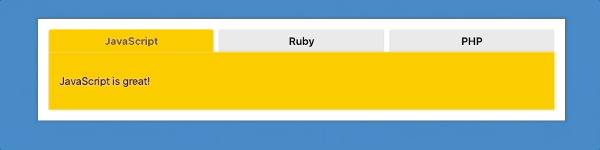

> This is a JavaScript practice from [Slam Dunk JS](https://beginnerjavascript.com/) course by [Wes Bos](https://github.com/wesbos).

# 36 - Tabs

#### LIVE LINK: 

https://nhingo.com/SlamDunkJS/36-tabs/index.html

## User Stories

- I can click on the tab to show its corresponding tab panel.

## Notes

https://www.notion.so/nhiyngo/JS-36-Tabs-4033ef4f9e3f4929a5e492419c89d609