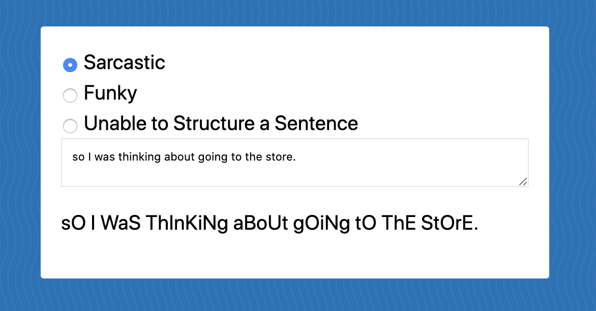

> This is a JavaScript practice from [Slam Dunk JS](https://beginnerjavascript.com/) course by [Wes Bos](https://github.com/wesbos).

# 56 - Sarcastic Text Generator

#### LIVE LINK:

https://nhingo.com/SlamDunkJS/56-text-generator/

## User Stories

- I can click on different radio buttons to generate different types of text.
