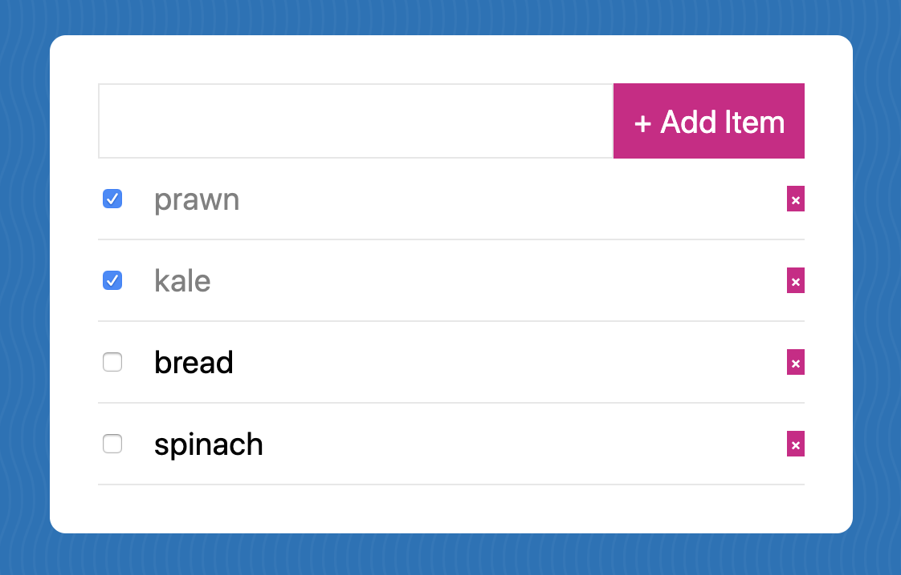

> This is a JavaScript practice from [Slam Dunk JS](https://beginnerjavascript.com/) course by [Wes Bos](https://github.com/wesbos).

# 57 - Shopping Form with Custom Events, Delegation and localstorage

A shopping list that allows users to create and keep track of the items. Items can be marked as complete or incomplete, so users know what's still on their list.

#### LIVE LINK:

https://nhingo.com/SlamDunkJS/57-shopping-list/

## User Stories

- I can enter the items in the input field and hit Enter or +Add Item button.
- I can click on the checkbox to mark the items as complete.
- I can also click on the X button to remove the items from the list.
- The items will be stored in the local storage and ready to be restored on page load.

## Notes

https://www.notion.so/nhiyngo/JS-57-Shopping-Form-with-Custom-Events-Delegation-and-localstorage-54598a90203d4cdc92e7fa72c020cd2b
