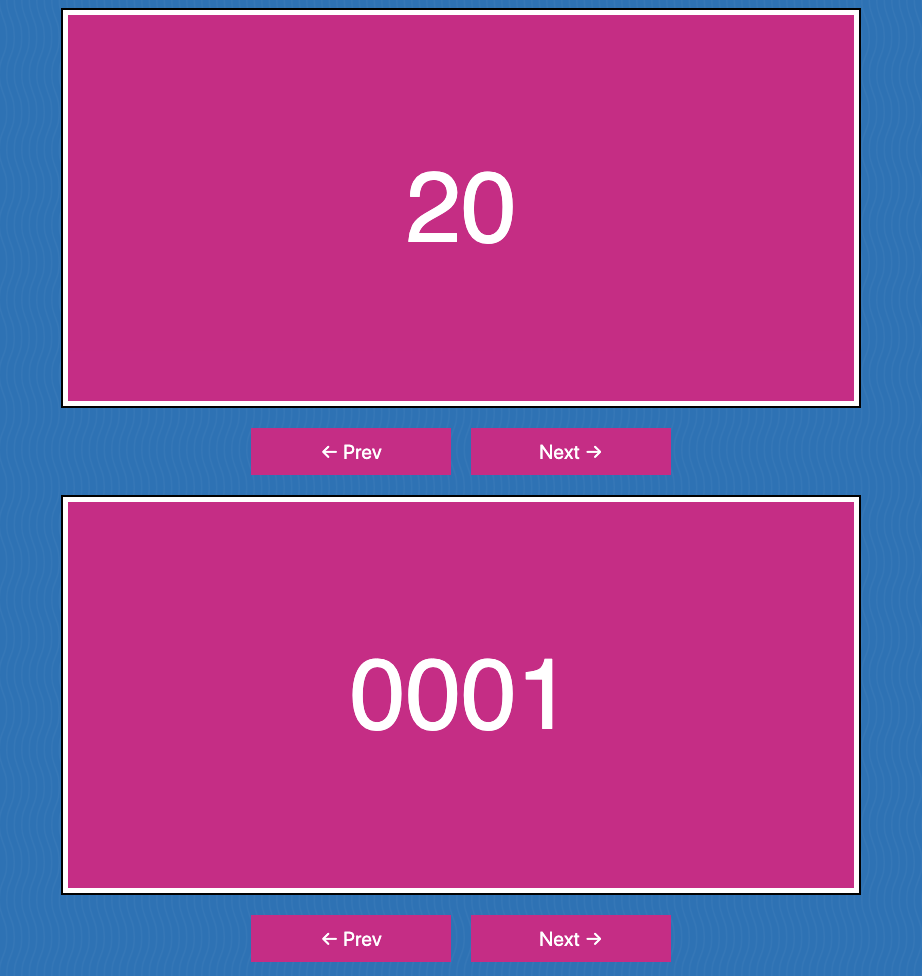

> This is a JavaScript practice from [Slam Dunk JS](https://beginnerjavascript.com/) course by [Wes Bos](https://github.com/wesbos).

# 59 - Slider

#### LIVE LINK

https://nhingo.com/SlamDunkJS/59-slider/

