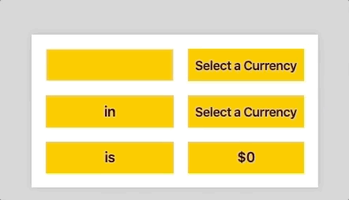

> This is a JavaScript practice from [Slam Dunk JS](https://beginnerjavascript.com/) course by [Wes Bos](https://github.com/wesbos).

# 79 - Currency Converter Modules Refactor

#### LIVE LINK: https://nhingo.com/SlamDunkJS/79-currency-modules-refactor

## User Stories

* The list of currencies delays showing until I hover over the app. Additionally, the app starts running when I input an amount into the box.

## Notes

Refactor of [77-Currency Converter](https://github.com/nhiyngo/Slam-Dunk-JavaScript/tree/master/77-Currency%20Converter) using [78-Modules](https://github.com/nhiyngo/Slam-Dunk-JavaScript/tree/master/78-Modules).

`money.js` serves as an entry point where other sections like list of currencies, list of variables, utilities, event handlers, library (which contains our core functions of the app) functions, etc... are split and putted in their own files. We have `utils.js`, `handlers.js`, `currencies.js` ,`init.js`, `library.js`,`elements.js`.